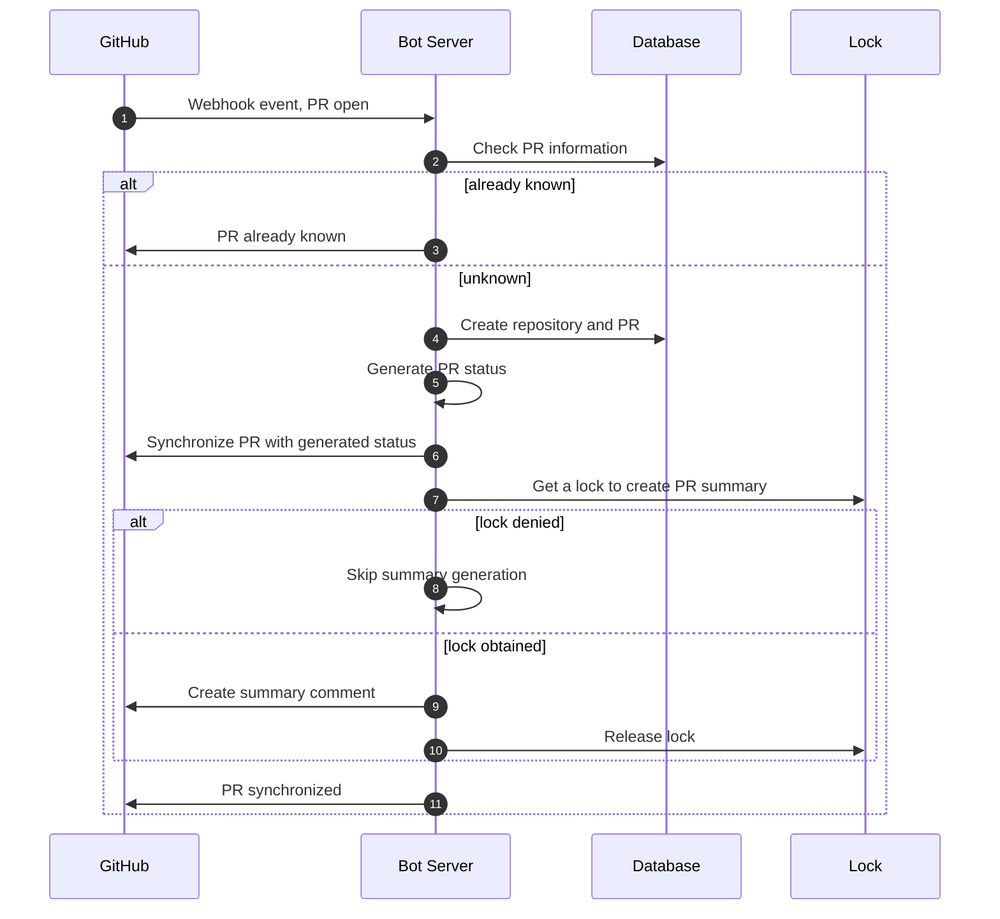
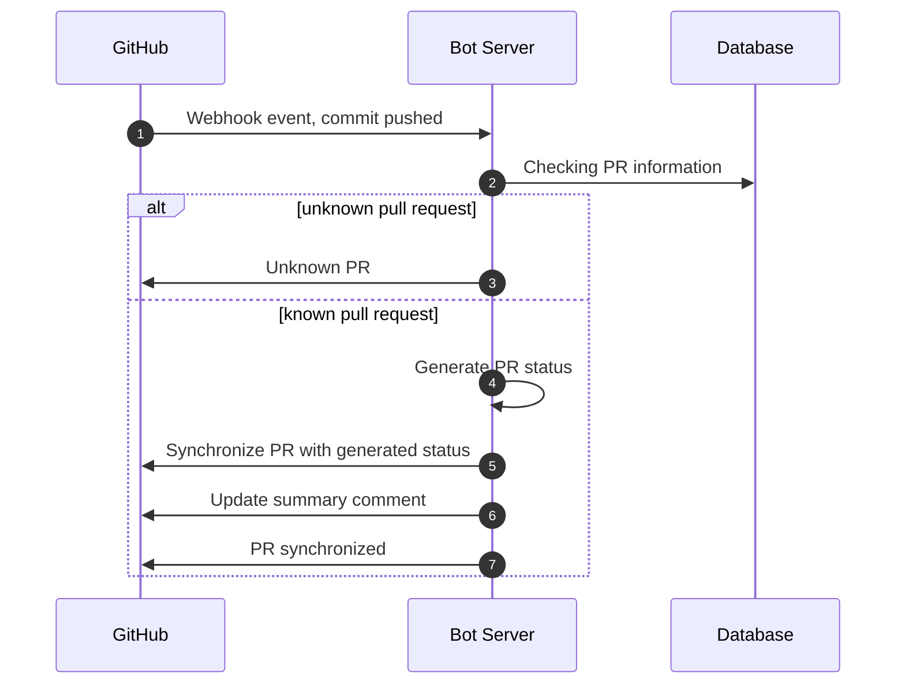
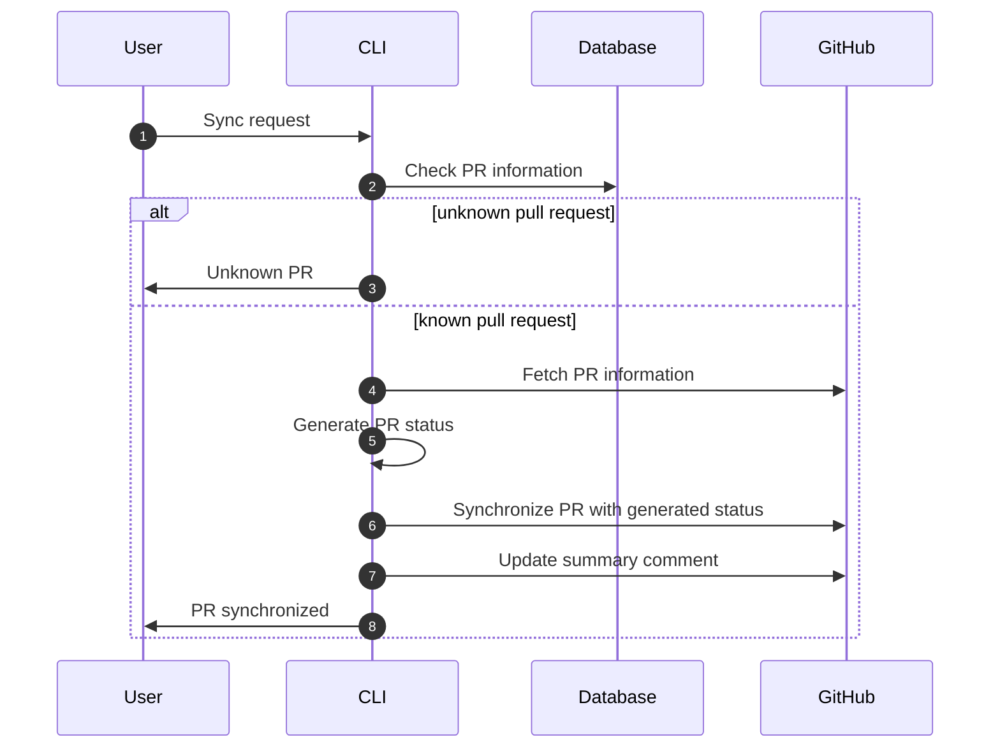

# Sequences

## Pull Request open

```mermaid
sequenceDiagram
    autonumber
    participant gh as GitHub
    participant bot as Bot Server
    participant db as Database
    participant lock as Lock

    gh->>bot: Webhook event, PR open
    bot->>db: Check PR information
    alt already known
        bot->>gh: PR already known
    else unknown
        bot->>db: Create repository and PR
        bot->>bot: Generate PR status
        bot->>gh: Synchronize PR with generated status
        bot->>lock: Get a lock to create PR summary
        alt lock denied
            bot->>bot: Skip summary generation
        else lock obtained
            bot->>gh: Create summary comment
            bot->>lock: Release lock
        end
        bot->>gh: PR synchronized
    end
```

## On Pull Request push

```mermaid
sequenceDiagram
    autonumber
    participant gh as GitHub
    participant bot as Bot Server
    participant db as Database

    gh->>bot: Webhook event, commit pushed
    bot->>db: Checking PR information
    alt unknown pull request
        bot->>gh: Unknown PR
    else known pull request
        bot->>bot: Generate PR status
        bot->>gh: Synchronize PR with generated status
        bot->>gh: Update summary comment
        bot->>gh: PR synchronized
    end
```

## CLI sync command

```mermaid
sequenceDiagram
    autonumber
    participant user as User
    participant cli as CLI
    participant db as Database
    participant gh as GitHub

    user->>cli: Sync request
    cli->>db: Check PR information
    alt unknown pull request
        cli->>user: Unknown PR
    else known pull request
        cli->>gh: Fetch PR information
        cli->>cli: Generate PR status
        cli->>gh: Synchronize PR with generated status
        cli->>gh: Update summary comment
        cli->>user: PR synchronized
    end
```